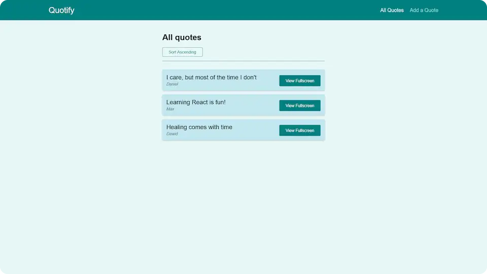

# 💬 Quotify

**Display and add quotes. A demo project with React Router.**

## 💻 Screenshot

## 🛠️ Tools and technologies
`React` `React Router` `CSS` `Create React` `VS Code`

By preparing this project I learned basics about **React Router**.

## 🌐 Deployment
Deployed on `Netlify`.

Live preview at [saitama-quotify.netlify.app](https://saitama-quotify.netlify.app/).

## 🎓 Related course
This project was created as a part of the [Udemy](https://www.udemy.com/ 'Udemy') course [_React - The Complete Guide (incl Hooks, React Router, Redux)_](https://www.udemy.com/course/react-the-complete-guide-incl-redux/ 'See this course on Udemy') by [Maximilian Schwarzmüller](https://twitter.com/maxedapps 'Maximilian Schwarzmüller on Twitter').
